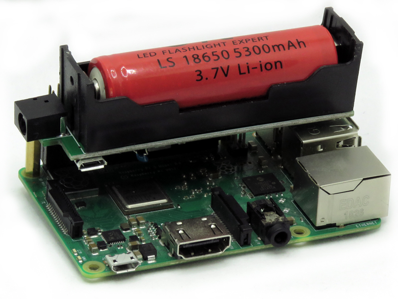

[](https://www.sequentmicrosystems.com)

# wdt-rpi
[](https://www.sequentmicrosystems.com)

Raspberry pi libraries and command line interface for controlling the [Super-Watchdog with Battery Backup for Raspberry Pi](https://sequentmicrosystems.com/products/super-watchdog-hat-with-battery-backup-for-raspberry-pi)

## Usage

```bash
~$ git clone https://github.com/SequentMicrosystems/wdt-rpi.git
~$ cd wdt-rpi/
~/wdt-rpi$ sudo make install
```

Now you can access all the functions of the Watchdog card through the "wdt" command.
If you clone the repository, any update can be made with the following commands:

```bash
~$ cd wdt-rpi/  
~/wdt-rpi$ git pull
~/wdt-rpi$ sudo make install
```  
### Usage Example

For safety shutdown when the main power is off and the backup battery is discharging you can create a shell script like the following one and run from cron at fixed intervals, let's say 1 minute. 
```bash
#Read the battery voltage
var1=$(wdt -g vb)
#Set the voltage threshold in millivolts
var2=3600
date1=$(date -u)
if [ $(($var1)) -lt $var2 ]; then
    #Make the wdt not power back on the RPI when on battery
    wdt -rob 0
    #Set the period to a value that allow RPI to finish shutdown until wdt expire
    wdt -p 30
    echo $date1 ": Shutdown" >> /home/pi/wdtlog
    #Shut down the RPI and will back on when main power is back
    sudo shutdown now
else
    #reload the counter
    wdt -r
fi    
    echo $date1 ": Battery" $var1 "mV">> /home/pi/wdtlog
```
The script monitors your battery voltage and if is dropping below a certain threshold, will inform the watchdog to not repower until the main power source comes back and shut down the RPI. This script also reloads the watchdog counter and log the activity for future analisys.

For actually use this you need to create a file let's say wdt.sh in /home/pi folder:
```bash
    nano /home/pi/wdt.sh
```
paste the code hit ^O for save and ^X for exit.

Give the file execution rights:
```bash
    sudo chmod +x wdt.sh
```
Edit crontab:
```bash
    crontab -e
```
At the end of the file add the folowing line:
```bash
    * * * * * sudo /home/pi/wdt.sh
```
This will run the script every minute

Please keep in mind that the battery voltage threshold must be chused taking into account:
* Raspberry power consumption
* Battery real capacity
* The watchdog cut the power without notice if the battery voltage drops below 2.8V to prevent over-discharge.
* The time until the script will be recalled
* The time until your raspberry finishes the shutdown process. 


## Python [library](https://github.com/SequentMicrosystems/wdt-rpi/tree/master/python)
